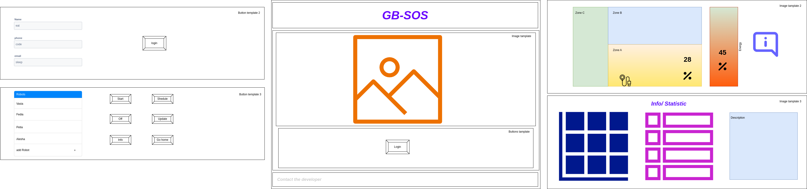
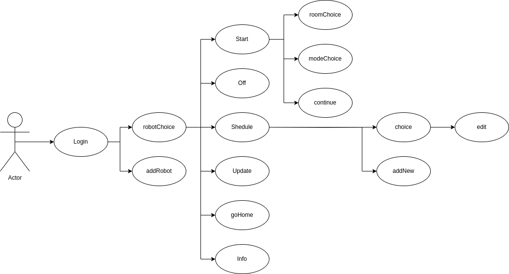
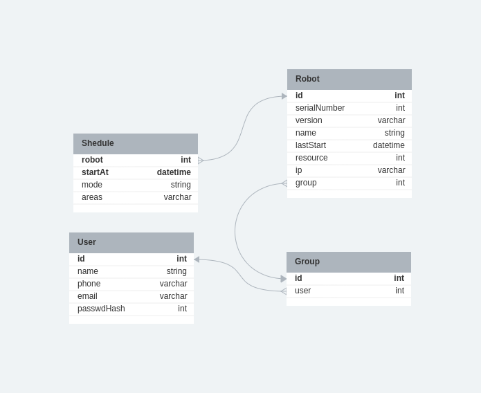
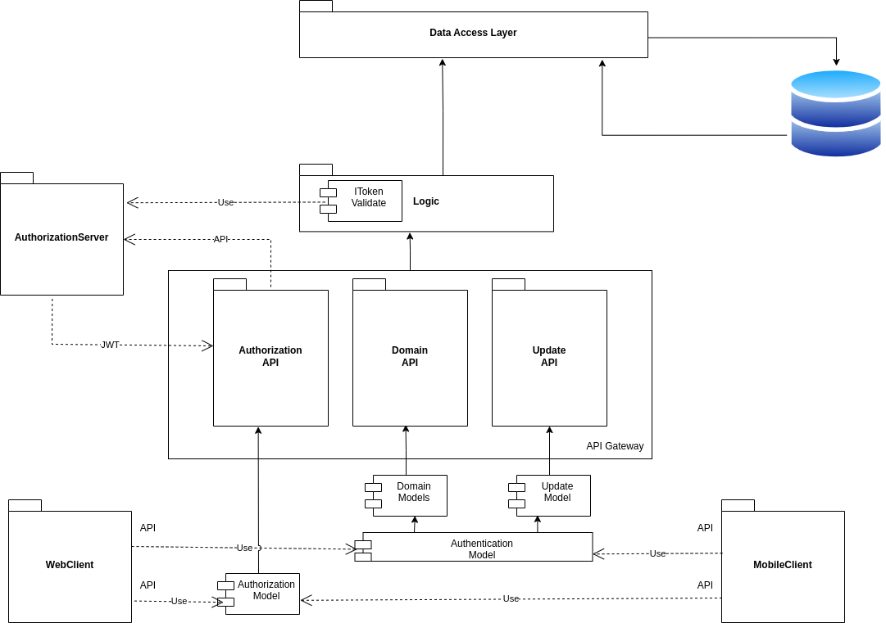

# GB-SOS &trade;

> **_Task:_** Спроектировать облачное приложение с интерфейсами в браузере и нативными интерфейсами в мобильных устройствах.

## Application design(SPA)

## Use-Case diagram

## Entities Relationship diagram

## OpenAPI

## Components schema

