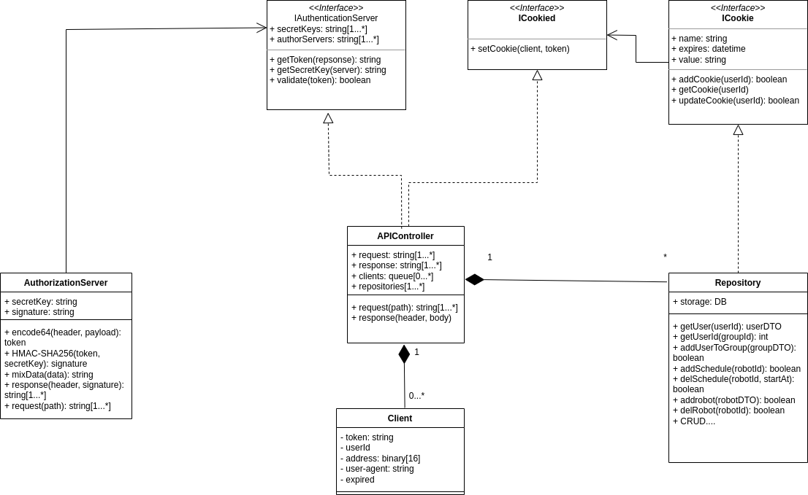

# GB-SOS &trade;

> **_Task:_** Спроектировать облачное приложение с интерфейсами в браузере и нативными интерфейсами в мобильных устройствах.

## Application design(SPA)

## UAT

|User case|Action|Expected result|Truth|
|---|---|---|---|
|Login|Войти в приложение используя логин и пароль|Происходит авторизация, открывается страница с доступными устройствами||
|RobotChoice|Выбор устройства из списка доступных|Происходит поключение к устройству по Bluetooth/WiFi, отображается картинка о текущем состоянии устройства||
|addRobot|Добавление устройства путем внесения серийного номера или сканирования QR-code|Происходит подключение к устройству с загрузкой информации(версия прошивки, состояние аккумулятора и т.п.) и сохранение его в базу данных||
|Start|Происходит подключение к устройству и загрузка карты помещения, доступных режимов уборки|Выводится отображение зон уборки, режимов уборки, статус уборки и устройства, запрос на продолжение||
|Schedule|Происходит загрузка доступных расписаний стартов уборки, синхронизация с сервером|Отображается расписание стартов уборки, режимов, зон||

## Use-Case diagram

## Entities Relationship diagram

## OpenAPI

## Components schema

## Authorization schema

## E2E

|Function|Expected result|
|---|---|
|Login|Проверяется токен доступа.Если expired перенаправляется на авторизацию. Проверяется пароль. Возвращает ID юзера.
|addRobot|Проверяется токен доступа. Данные робота сохраняются в БД, присваивается ID, groupId. Возвращает булевое значение|
|addUser|Проверяет токен доступа. Данные юзера сохраняются в БД, присваивается ID. Возвращает булевое значение|
|getRobots|Проверяется токен доступа. Возвращается список роботов по groupId|
|delRobot|Проверяется токен доступа. Из БД удаляется робот по robotId|
