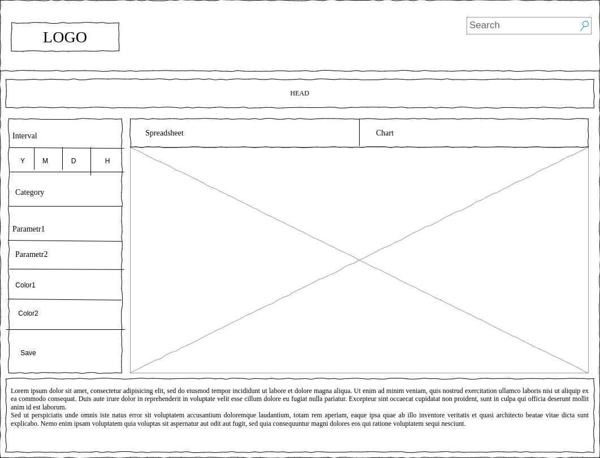

# Report Service Domain

## Entities

* Company
  * company_name
  * company_address
  * founder
  * phone_number
  * report_id
* Category
  * category_name
  * category_id
* Product
  * product_id
  * category_id
  * product_name
  * price
  * unit
  * provider_id
  * description
* Provider
  * provider_id
  * provider_name
  * address
  * phone
  * contract
* Report
  * report_id
  * head
  * body

## Design

## ERG

## Component schema

