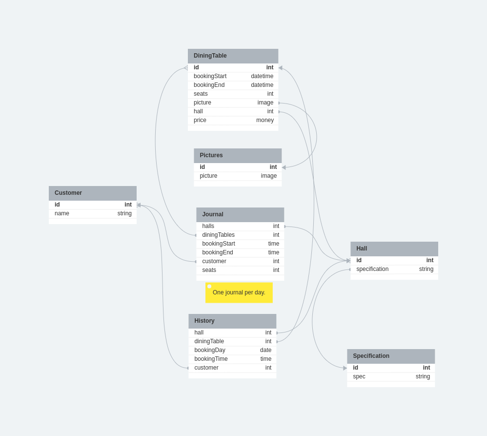
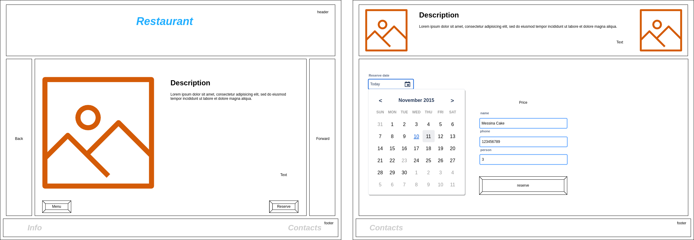
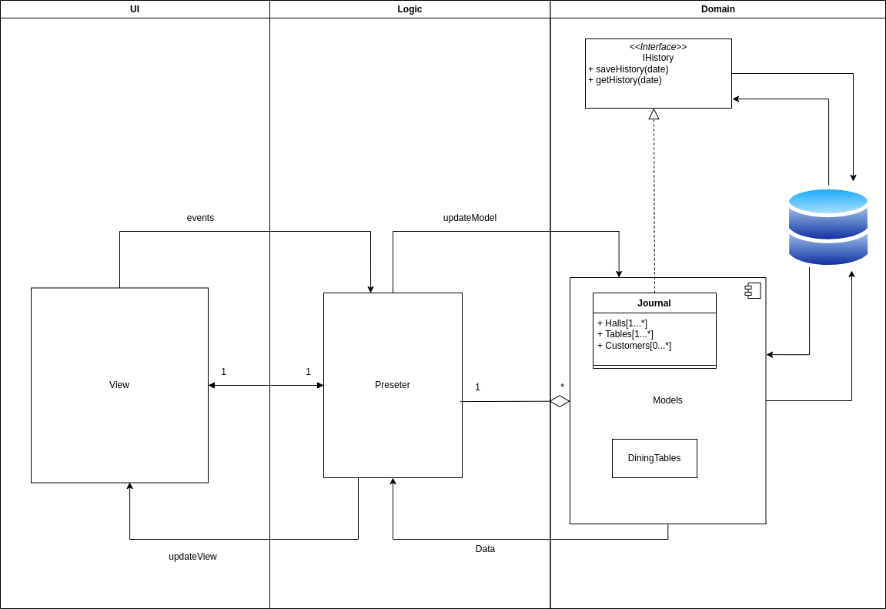

# Restaurant reservation service

>Task:
>
>* Разработать сервис по заказу столиков в ресторане.
>* Разработать экранные формы интерфейса в <https://www.figma.com/> или <https://app.diagrams.net/>.
>* Разработать полную ERD домена в <https://www.dbdesigner.net/>.
>* Разработать блок-схему алгоритма взамодействия MVP.

## Entities

* Customer
  * id
  * name
* DiningTable
  * id
  * bookingSatrt
  * bookingEnd
  * seats
  * picture
  * hall
  * price
* Hall
  * id
  * specification
* Pictures
  * id
  * image
* Journal
  * halls
  * diningTables
  * bookingStart
  * bookingEnd
  * customer
  * seats
* History
  * hall
  * diningTable
  * bookingDate
  * bookingTime
  * customer

> **_Note:_**
&nbsp;Журнал бронирования создается на конкретную дату свой и сохраняется в БД. При резерве столика заносятся записи в журнал. Далее он используется администратором. По истечении дня записи журнала сохраняются в историю для ведения статистики.
___

## Entity Relationships

## Site design

## Component interaction

