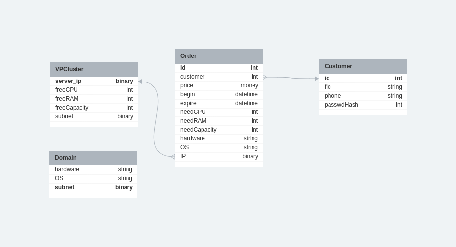
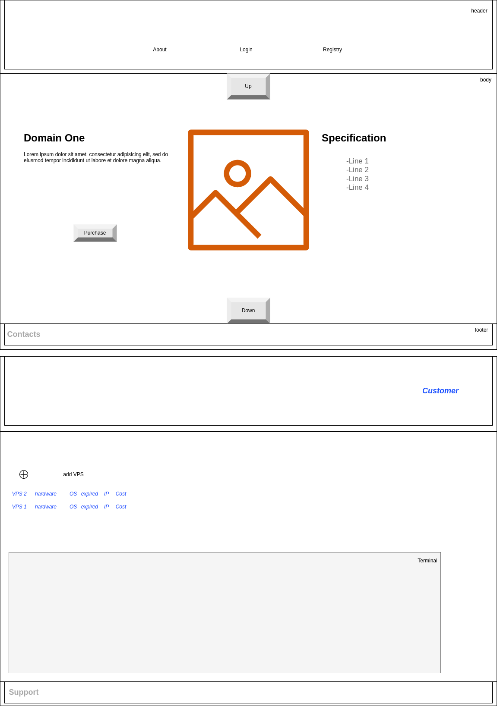

# GB Cloud &#9729;

>Tasks:
>
>* Разработать экранные формы интерфейса для заказа ресурсов в облачном сервисе в <https://www.figma.com/> или <https://app.diagrams.net/>.
>* Разработать полную ERD домена в <https://www.dbdesigner.net/>.
>* Дополнить swagger ответами домена (сутевые ответы) о статусе заказа ресурсов (создан, ошибка, нет ответа) и смоделировать ошибки REST «400, 500» типов.

## Entities

* Customer
  * id
  * fio
  * phone
  * passwdHash
* Order
  * id
  * customer
  * price
  * begin
  * expire
  * needCPU
  * needRAM
  * needCapacity
  * hardware
  * OS
  * IP
* Domain
  * hardware
  * subnet
  * OS
* VPCluster
  * server_ip
  * freeCPU
  * freeRAM
  * freeCapacity
  * subnet

> **_Note:_**&nbsp;Its own table for each cluster. Each cluster has a pre-installed OS and a dedicated range of address types. The customer is given a server with an IP address from a cluster suitable for it.

## Entities relationship

## OpenAPI

[API version 1.0](./openapi.yaml)

* /VPS - Buy private server
* /Customer - Create customer(POST) or login(GET)

## Site design

