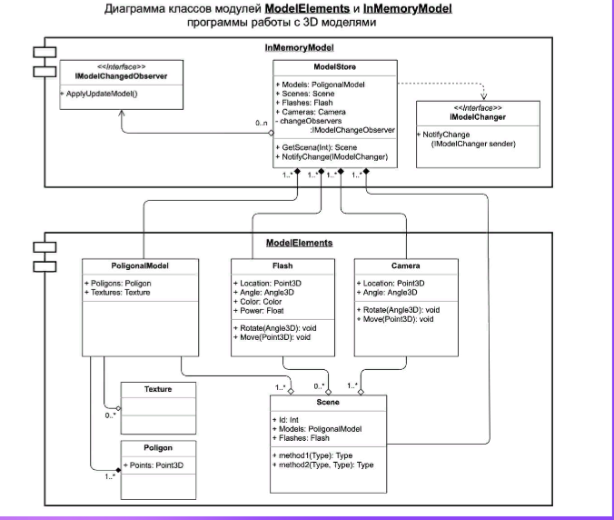
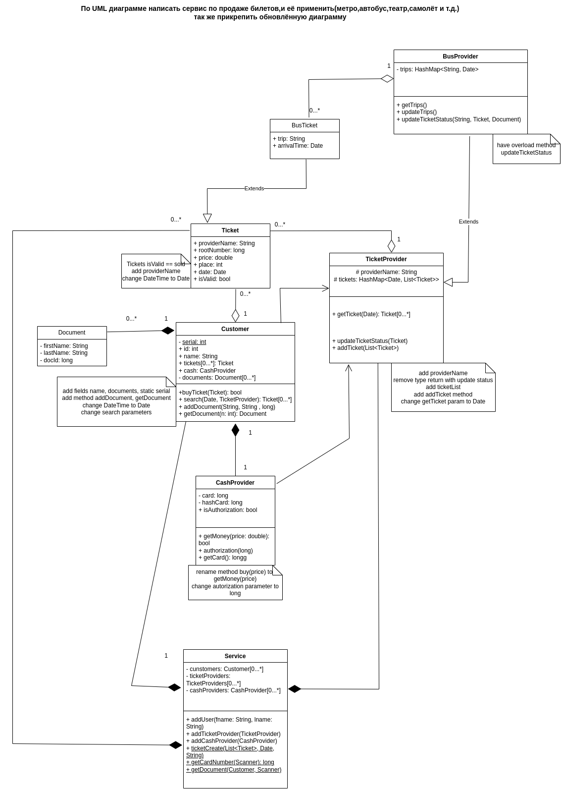

# software-architecture

## Lesson 1

Realize a UML diagram below

>1. На основе Диаграмы классов ModelElements, разработать классы: Model Store, PoligonalModel (Texture, Poligon), Flash, Camera, Scene

## Lesson 2

Patterns

>Realization of fabric.

## Lesson 3

* SRP

>Принцип единственной ответственности.

* OCP

>Принцип открытости-закрытости.

* LSP

>Принцип подстановки Б.Лисков.

* ISP

>Принцип разделения интерфейсов.

* DIP

>Принцип инверсии зависимостей.

## Lesson 4

Contract First

Realize a UML diagram below

